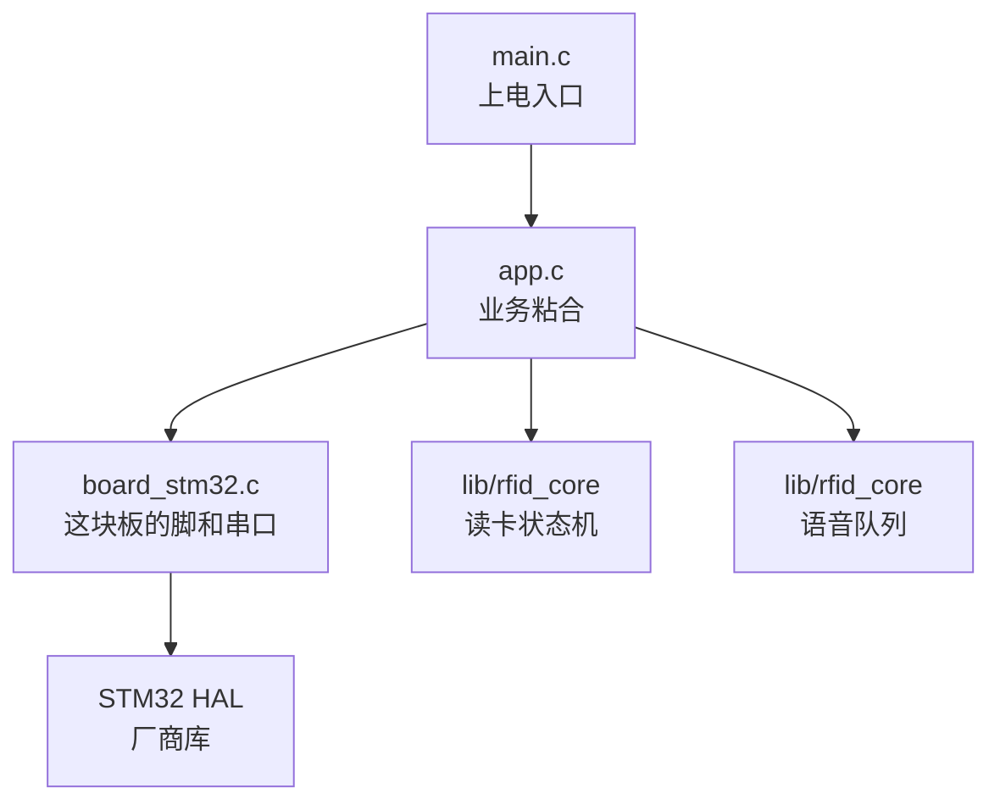
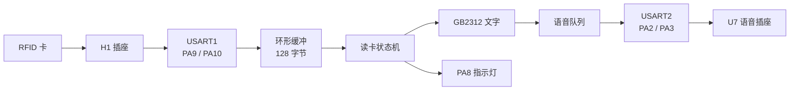

# 总览

这套固件做一件事：把 RFID 卡上的文字念出来。

## 产品行为

- 空闲时，每隔约 80 ms 问一次读卡器「有没有卡」。
- 读到卡后，读数据块，拼出 GB2312 文字。
- 文字进语音队列，按顺序念。
- 队列满了会稍后重试，这张卡不会被丢掉。
- 同一张卡一直放着，只念一次。拿走再放回来，会再念一次。
- 读到卡时，`PA8` 的指示灯亮约 500 ms。
- 电机默认不转。

## 分层

| 层 | 文件 | 管什么 |
|---|---|---|
| 入口 | [[src-main.c]] | 先硬件，再业务，然后一直转 |
| 应用 | [[src-app.c]] | 把读卡结果送到语音，点灯 |
| 板级 | [[src-board_stm32.c]] | 时钟、串口、指示灯、可选电机 |
| 库 | `lib/rfid_core` | 协议、读卡状态机、语音队列，不改 |

## 数据怎么走

## 关键决定

- 判重看卡片 UID，不看文字。两张卡写一样的字，会各念一次。
- 文字按显式长度发送，不靠字符串结尾。GB2312 里可能有 `0x00`。
- 语音队列满时，读卡状态机保住这张卡，过一会儿再送。
- 所有等待都不阻塞。主循环转得很快，空了就睡。

## 下一步

- 硬件怎么接：[[01-硬件对照]]
- 程序怎么转：[[02-主循环]]
- 一张卡的全过程：[[03-读卡到播报]]
