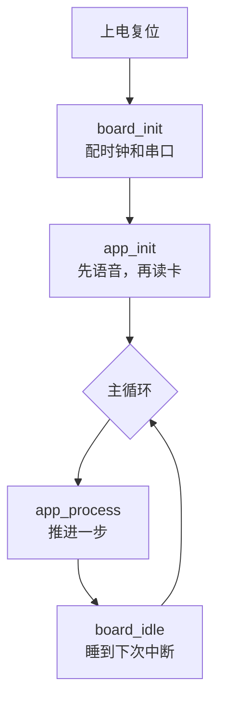
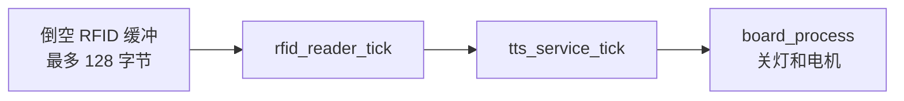

# 主循环

上电后程序只做三件事：配硬件、建业务、然后一直转。

## 启动顺序

对应代码在 [[src-main.c]] 的 `main`。

## 每一圈做什么

`app_process` 在 [[src-app.c]]。顺序固定：

1. 把 USART1 环形缓冲里的字节喂给读卡状态机。上限是缓冲长度，避免中断一直进数时卡在这里。
2. 推进读卡状态机。
3. 推进语音队列。
4. 推进板级定时：到点关灯，开了电机就推电机。

## 为什么不阻塞

读卡、语音、灯都用时间戳和状态机。没有 `delay`，没有死等。

主循环空了就调 `board_idle`，让 CPU 睡到下一次中断。唤醒源是 SysTick 和 USART1，最坏睡 1 ms。

## 时间从哪来

`board_millis()` 读 HAL 的毫秒计数。SysTick 每 1 ms 加一次。到 2^32 会翻回 0，比较时间时已经处理了翻转。

## 下一步

- 一张卡怎么被念出来：[[03-读卡到播报]]
- 板级每个函数做什么：[[src-board_stm32.c]]
