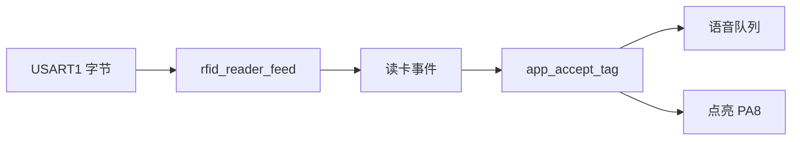

# src/app.c

把读卡结果送到语音队列，并点一下指示灯。

源文件：`src/app.c`

## 这个文件管什么

它是应用层。不碰寄存器，只管三件事：读卡、语音、灯。



## 静态变量

| 名字 | 类型 | 说明 |
|---|---|---|
| `g_reader` | `rfid_reader_t` | 读卡状态机实例 |
| `g_tts` | `tts_service_t` | 语音队列实例 |

单片机上没有堆，也只需要一份，所以做成静态全局。

## 对外函数

### app_init

```c
void app_init(uint32_t now_ms)
```

做什么：先准备语音，再准备读卡。

为什么先语音：读卡器一启动就可能上报卡片，语音队列必须先能收。

### app_process

```c
void app_process(uint32_t now_ms)
```

做什么：

1. 倒空 RFID 环形缓冲，最多 128 字节。
2. 推进读卡状态机。
3. 推进语音队列。
4. 推进板级定时。

倒空循环的上限写成 `BOARD_RFID_RX_RING_SIZE`，避免中断一直进数时卡在这里。

## 内部函数

### app_write_rfid

```c
static bool app_write_rfid(void *context, const uint8_t *data, size_t length)
```

把读卡命令发到 RFID 串口。只有 `BOARD_OK` 才返回 `true`。

库的回调类型是 `bool`，签名不能改。

### app_write_tts

```c
static bool app_write_tts(void *context, const uint8_t *data, size_t length)
```

把语音文字发到语音串口。只有 `BOARD_OK` 才返回 `true`。

### app_accept_tag

```c
static bool app_accept_tag(const rfid_reader_event_t *event)
```

文字入队。入队成功就点亮 `PA8`。

队列满返回 `false`，读卡器会保住这张卡，过一会儿再送。

### app_on_rfid_event

```c
static bool app_on_rfid_event(void *context, const rfid_reader_event_t *event)
```

读卡事件入口。只处理「读到卡」这一类，其它事件直接放过。

`event` 为空时返回 `true`，避免卡死重试。

### app_load_reader_config

```c
static void app_load_reader_config(rfid_reader_config_t *config)
```

先取库的默认参数，再用 [[include-app_config.h]] 里的值覆盖。

## 和其它文件的关系

- 板级接口：[[include-board.h]]
- 配置数字：[[include-app_config.h]]
- 读卡状态机：库 `lib/rfid_core`，不改

## 相关页

- [[03-读卡到播报]]
- [[02-主循环]]
