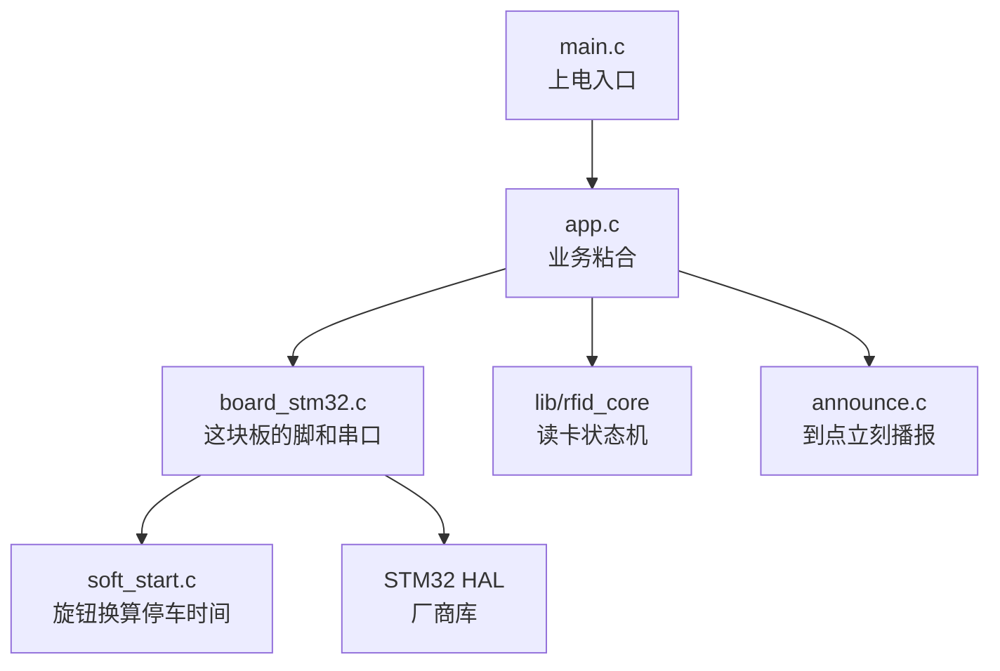
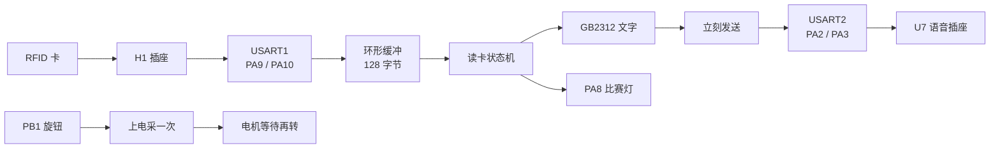

# 总览

这套固件做一件事：把 RFID 卡上的文字念出来。

## 产品行为

- 空闲时，每隔约 40 ms 问一次读卡器「有没有卡」。
- 读到卡后，读数据块，拼出 GB2312 文字。
- 读到就念。下一张不同的卡会打断上一句。
- 同一张卡一直放着，只念一次。拿走再放回来，会再念一次。
- 读到卡时，`PA8` 的比赛灯亮约 500 ms。
- 电机默认会转。上电后固定等 3 秒再转。跑多久后停，由 `PB1` 旋钮决定。

## 分层

| 层 | 文件 | 管什么 |
|---|---|---|
| 入口 | [[src-main.c]] | 先硬件，再业务，然后一直转 |
| 应用 | [[src-app.c]] | 读到卡立刻发文字，点灯 |
| 板级 | [[src-board_stm32.c]] | 时钟、串口、比赛灯、旋钮、电机 |
| 换算 | `src/soft_start.c` | 把 ADC 读数换成停车毫秒数 |
| 播报 | `src/announce.c` | 到点立刻发文字，不排队 |
| 库 | `lib/rfid_core` | 协议、读卡状态机。库里还有语音队列，应用层不用。不要改库 |

## 数据怎么走

## 关键决定

- 判重看卡片 UID，不看文字。两张卡写一样的字，会各念一次。
- 文字按显式长度发送，不靠字符串结尾。GB2312 里可能有 `0x00`。
- 读到就发。上一句没念完也发，模块会被打断。这是比赛要的。
- 串口没发出去才重试。这不是排队。
- 所有等待都不阻塞。主循环转得很快，空了就睡。

## 下一步

- 硬件怎么接：[[01-硬件对照]]
- 程序怎么转：[[02-主循环]]
- 一张卡的全过程：[[03-读卡到播报]]
