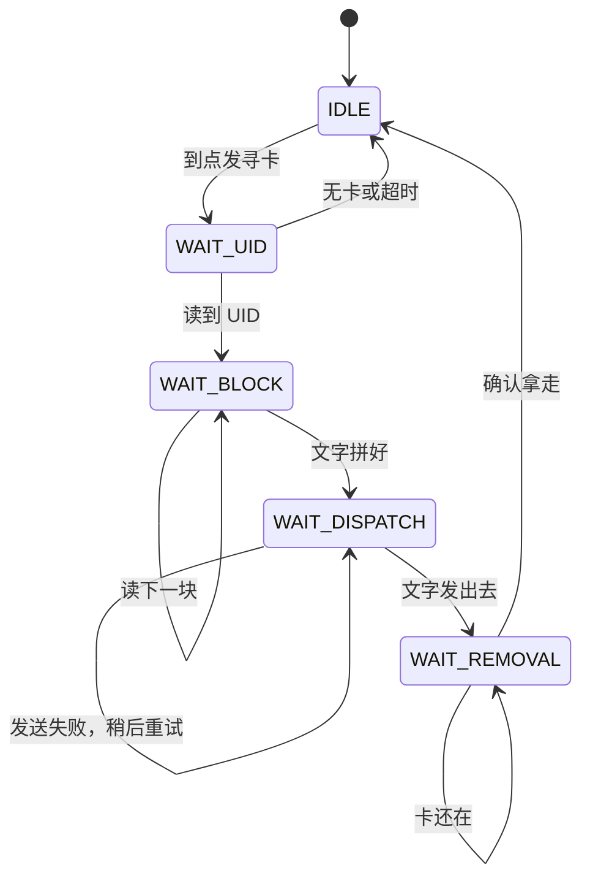
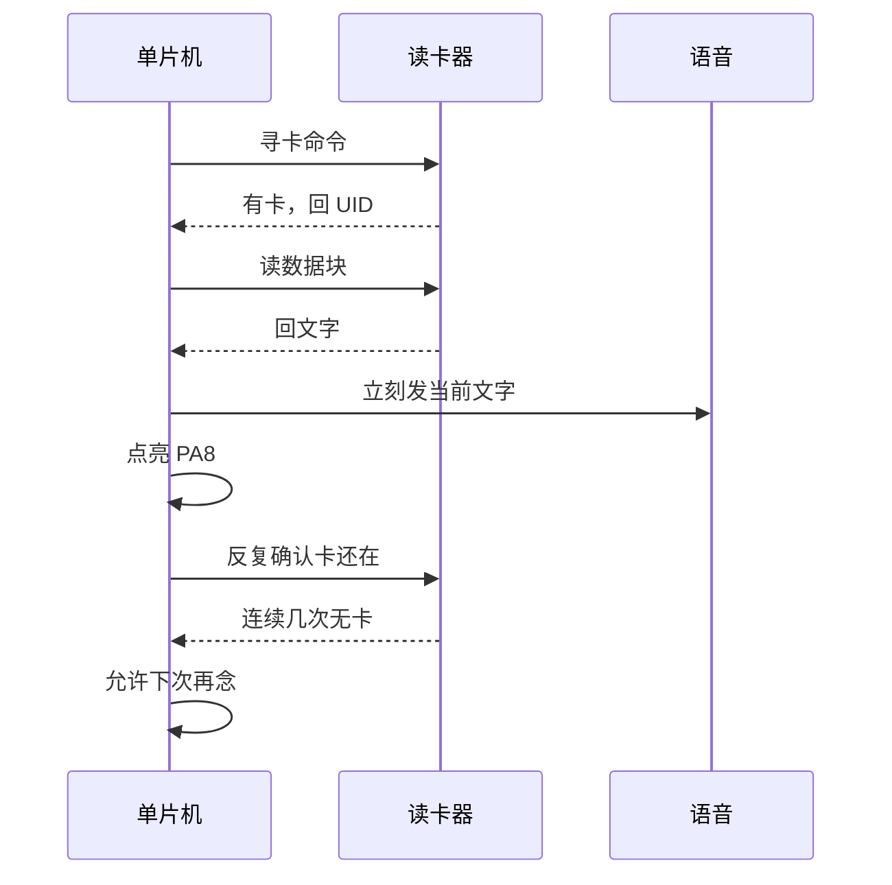

# 读卡到播报

这一页讲一张卡从靠近到被念出来的全过程。

## 状态机

读卡流程在库 `lib/rfid_core` 里。应用层只在 [[src-app.c]] 里接结果，立刻发文字。

## 一张卡的时间线

## 关键规则

- 读到就念。下一张不同 UID 的卡会马上改念，打断上一句。
- 同一张卡一直放着，只念一次。靠 UID 判重。
- 拿走再放回，会再念一次。靠连续几次读不到来确认。
- 串口没发出去才重试。读卡器会保住这张卡。这不是排队。
- 非法 GB2312 不会送给语音。

## 和代码的关系

- 事件怎么立刻发出去：[[src-app.c]] 的 `app_on_rfid_event`
- 串口字节怎么进来：[[src-board_stm32.c]] 的 `HAL_UART_RxCpltCallback`
- 读卡节奏在哪调：[[include-app_config.h]]

## 下一步

- 每个函数做什么：[[04-函数索引]]
- 出问题怎么查：[[06-故障排查]]
