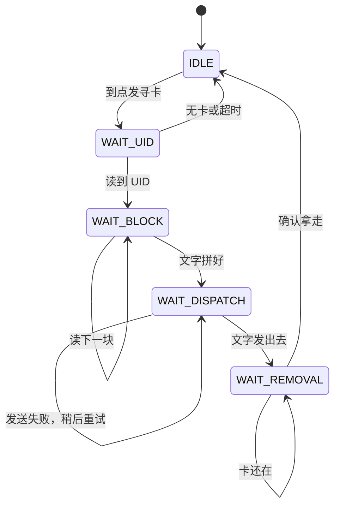

# 模块原理

这一页讲 RFID、语音、缓启动、电机和灯分别做什么。实现细节点各源文件页。

总图见 [[00-总览]]。一张卡的全过程见 [[03-读卡到播报]]。

## RFID

读卡分两层。都在库 `lib/rfid_core` 里，不要改。

### 串口协议

`rfid_protocol` 只管拼帧和拆帧。

帧的样子：

```
0x7F  长度  地址  命令  [状态]  [数据...]  校验
```

三个规则：

1. `0x7F` 是帧头。数据里出现 `0x7F` 时写成两个，接收方再还原成一个。这样单个 `0x7F` 一定表示新帧开始。
2. 长度字段算的是「去掉帧头之后到校验之前」的字节数，再加上校验本身。
3. 校验是长度字段和整个帧体逐字节异或。

命令：`0x10` 寻卡（要 UID），`0x11` 读某一块。对应回复是 `0x90`、`0x91`。状态 `0x00` 成功，`0xFF` 无卡。

板上设备地址一直是 `0x00`。

### 读卡状态机

`rfid_reader` 决定什么时候发哪条命令。它不碰硬件。发数据走回调，收数据靠 `rfid_reader_feed` 一字节一字节喂。



默认读 4、5、6、8 号块，跳过物理块 7。四块拼起来最多 64 字节。

去重看 UID，不看文字。两张卡写一样的字，会各念一次。

确认拿走要连续几次读不到，默认 3 次。这是防抖，避免手抖一下就再念一遍。

应用层在 [[src-app.c]] 里接 `RFID_READER_EVENT_TAG`。立刻发文字，成功就点灯。返回 `false` 时，状态机保住这张卡，过一会儿再送。这不是排队。

USART1 先按 9600 发出改 115200 的命令，再改成工作波特率。改速命令的帧体在 [[src-board_stm32.c]]。

## 语音（TTS）

语音模块接 USART2，9600，只发不收。`SW1` 管模块电源。

库里的 `tts_service` 有 8 条队列，还会按字数估念完时间，忙的时候不发下一条。应用层不用它。

比赛要「读到就念」。应用层用 `announce.c`：

1. 开机记下「现在 + 500 ms」。到点先发 `<S>3`，把语速定下来。
2. `announce_speak_now` 立刻按显式长度发正文。语速如果还没发出去，会先发语速。
3. 没有 `busy_until_ms`，也没有队列。下一张不同 UID 的卡会打断上一句。

文字按长度发送，不靠 `\0` 结尾。GB2312 汉字的字节里可能出现 `0x00`，用字符串函数会截断。

串口没发出去，`announce_speak_now` 返回 `false`。读卡状态机会稍后重试。这只表示「这一帧没送出去」，不是「等念完」。

## 缓启动和停车旋钮

名字容易误会。这份固件里「缓启动」包含两段，代码不在同一个文件。

### 晚启动和爬升

在 [[src-board_stm32.c]]。`APP_ENABLE_MOTOR` 为 1 时才会编进来。

时序：

1. 上电后 `APP_MOTOR_START_LATE_MS`（默认 3000）以内，比较值为 0，电机不动。
2. 之后进入爬升。比较值按时间从 0 线性升到 `APP_MOTOR_TARGET_COMPARE`（默认 600）。爬升时长 `APP_MOTOR_RAMP_MS`（默认 3000）。
3. 爬完后保持 600，直到「已经转起来的时间」到达停车毫秒数。
4. 到点后比较值回到 0，电机停。

PWM 在 TIM2 通道 1 和通道 2，预分频 71，周期 999。比较值为 0 时，两路都写成 999，电机两端没有压差。前进时通道 1 为 0，通道 2 为比较值。

驱动芯片唤醒脚不在 MCU 上。只出 PWM，硬件没唤醒时电机不转。

### 旋钮换算

在 `src/soft_start.c`。这个文件不碰硬件。

上电时 `board_init` 从 `PB1` 采 20 次 12 位 ADC，取平均，然后只换算一次：

1. 原始值限制在 0～4095。
2. 按省赛分压公式，用串联 1 kΩ 和电位器 5 kΩ 估当前电阻。
3. 电阻再映射到 10 秒～10 分钟。

之后电机只读这次结果。旋钮中途再拧，要重新上电才生效。

旋钮不管起步时刻。起步永远是固定的 3 秒。

## 比赛灯

`PA8`，低电平点亮。上电先写高，再配成输出，避免闪一下。

读到卡并且文字发出去之后，[[src-app.c]] 调 `board_mark_tag`。灯亮，并记下熄灭时刻。`board_process` 每圈看一眼，到点拉高。

默认亮 500 ms。只表示「这张卡已经交给语音」，不是「念完了」。

## 主循环为什么不阻塞

读卡、语音、灯、电机都用时间戳和状态机。没有 `HAL_Delay` 死等。

主循环空了就 `WFI`。SysTick 每 1 ms 叫醒一次，USART1 收到字节也会叫醒。这样串口不容易堆满，电机爬升也能按毫秒推进。

时间比较用无符号减法，`uint32_t` 翻转到 0 仍然正确。

## 相关页

- 产品分层：[[00-总览]]
- 一张卡的时间线：[[03-读卡到播报]]
- 能调的数字：[[include-app_config.h]]
- 转到 Keil：[[08-Keil工程]]
